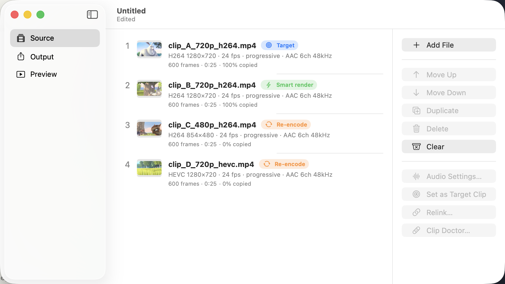
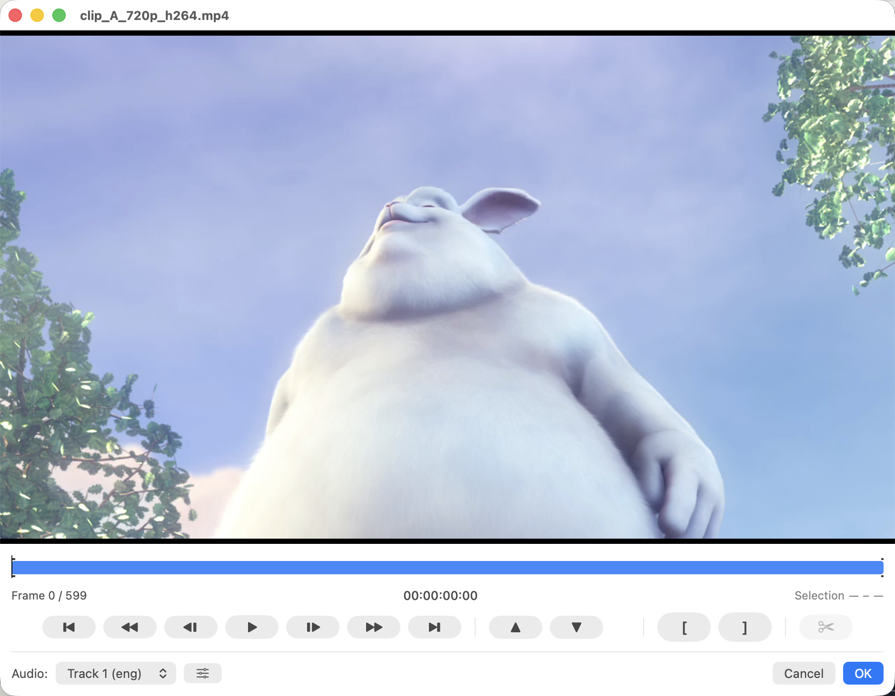
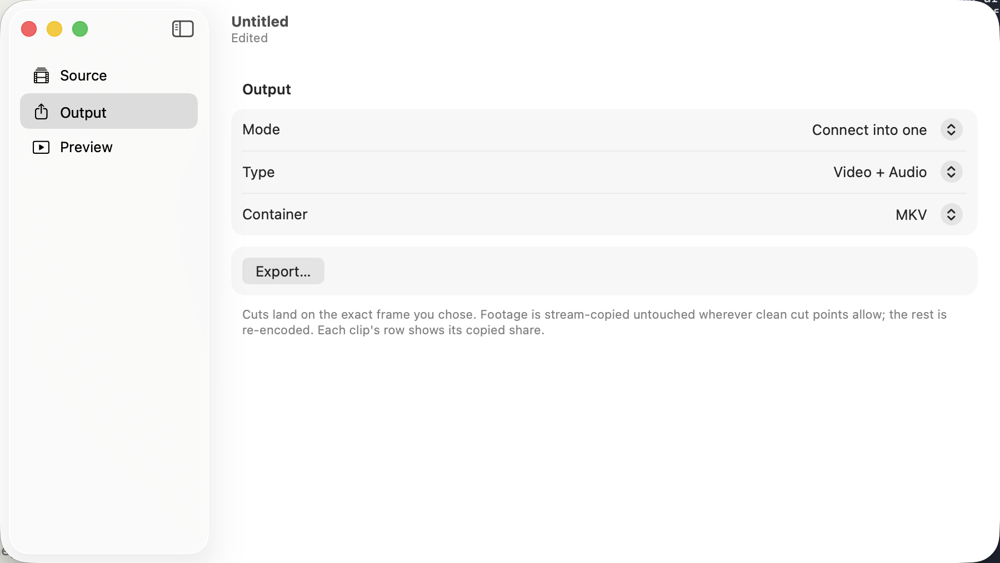

# ClipStitcher

Frame-accurate video joining for macOS via **smart rendering**: stream-copy every untouched
frame and re-encode only the partial GOPs at edit/join boundaries — near-instant, near-lossless
joins. Clips that don't match the target spec (codec, resolution, color, scan) are conformed
automatically.



## How it works

1. **Probe** each input — codec, profile/level, resolution, fps, pixel format, GOP, color.
2. **Classify** each in/out point — on a keyframe → stream-copy; between keyframes → re-encode
   only the partial GOP to the next keyframe, copy the rest.
3. **Concatenate** the segments (stream copy).

## Screenshots

| Cut editor | Output |
| --- | --- |
|  |  |

## Requirements

- macOS 14+
- Xcode 16+ (Swift 5)
- [XcodeGen](https://github.com/yonwoo9/XcodeGen) + FFmpeg: `brew install xcodegen ffmpeg`

## Build & run

```sh
xcodegen generate
open ClipStitcher.xcodeproj   # ⌘R to run
```

Builds out of the box with ad-hoc signing — no Apple account needed. `ffmpeg`/`ffprobe` are
located from your `PATH` (Homebrew) during development.

## Test

```sh
xcodebuild test -scheme ClipStitcher -destination 'platform=macOS' \
  ENABLE_DEBUG_DYLIB=NO ENABLE_HARDENED_RUNTIME=NO \
  -skip-testing:ClipStitcherTests/FieldCodedRepairIntegrationTests
```

## Keyboard shortcuts

Modifier order follows Apple's convention (⌃ ⌥ ⇧ ⌘). The transport and marking shortcuts
are also in the menu bar — **Playback** (Play/Pause, Step, Keyframe, Scene) and **Marking**
(Set In/Out, Split, Go To…) — for discoverability; the menu items act on the cut editor
when one is frontmost, and the shared transport items act on the output preview otherwise.

**Transport** (cut editor & preview)

| Key | Action |
| --- | --- |
| `Space` | Play / Pause |
| `←` `→` | Step one frame |
| `⇧←` `⇧→` | Step to previous / next keyframe |

**Cut editor only**

| Key | Action |
| --- | --- |
| `↑` `↓` | Previous / next scene change |
| `[` `]` | Set in / out point |
| `⌘B` | Split / unsplit at the playhead |
| `⌘J` | Go to a time or frame |

**Mouse / trackpad** (cut editor)

- Vertical scroll — scrub by frame
- `⇧` + scroll — stride by keyframe

## License

MIT — see [`LICENSE`](LICENSE). ClipStitcher drives FFmpeg as an external tool (not bundled);
see [`THIRD_PARTY_NOTICES.md`](THIRD_PARTY_NOTICES.md).
